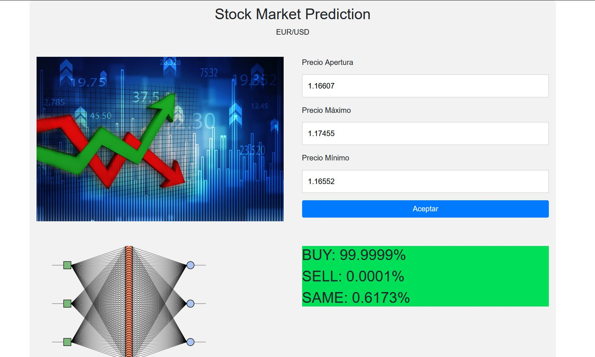

<!-- PROJECT LOGO -->
<br />
<p align="center">
    
  <h3 align="center">Stock Market Predict</h3>
</p>

<!-- TABLE OF CONTENTS -->
## Table of Contents

* [About the Project](#about-the-project)
  * [Built With](#built-with)
  * [Prerequisites](#prerequisites)
  * [Usage](#usage)
  * [Deploy](#deploy)

* [License](#license)
* [Contact](#contact)
* [Acknowledgements](#acknowledgements)


<!-- ABOUT THE PROJECT -->
## About The Project




### Built With
DEPLOY
* [Heroku](https://www.heroku.com)

ENVIRONMENT
* [Node.js](https://nodejs.org/en/)

WEBSITE
* [Bootstrap](https://getbootstrap.com)
* [JQuery](https://jquery.com)
* [Handlebars](https://www.npmjs.com/package/hbs)

GPU accelerated Neural networks in JavaScript for Browsers and Node.js
* [Brain.js](https://brain.js.org/#/)


### Prerequisites

This is an example of how to list things you need to use the software and how to install them.
* npm
```sh
npm install 
```

## Usage
Choose how many Hidden Layers you want, the larger the number of hidden layers in a neural network, the longer it will take for the neural network to produce the output and the more complex problems the neural network can solve.Introduce your inputs about one candle from the stock of EUR/USD, (4H timeframe recommend for higher accurate) but still working in whatever timeframe you want, then select the ACCEPT button and wait about 4 minutes, for 5 Hidden Layers default.

## Deploy
Heroku

* https://stock-nn.herokuapp.com/
